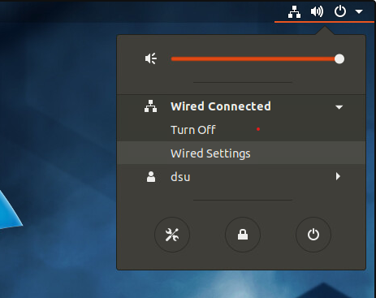

# Setting Static Addresses

#### For any OS:

1. Make sure that you set the IP address, subnet mask, default gateway, and DNS if necessary

### For Windows:

1. Open the start menu, and type Run and open the Run dialog box.
2. Inside the Run dialog box, type `ncpa.cpl` and hit `OK`.
3. Right click on the interface you are changing and select properties.
4. Click Internet Protocol Version 4 in the window.
5. Click Properties.
6. Set the addresses appropriately and click OK.

   

### For Linux:

1. Network Manager \(Graphical User Interface\)
2. Start by finding the wired settings under Wired Connected

3. Select the cog in the interface you want to modify

4. Select the IPv4 tab and modify settings as needed

5. Click Apply and then disable and re-enable the interface

#### OR

1. 2. Can be done through NetPlan,
   1. Navigate to /etc/netplan
   2. Modify the default netplan configuration file in that directory with correct YAML syntax

## **NOTE**: AFTER changing an IP address, be sure to stop and start \(disable/re-enable\) the interface otherwise the change may not take affect.

